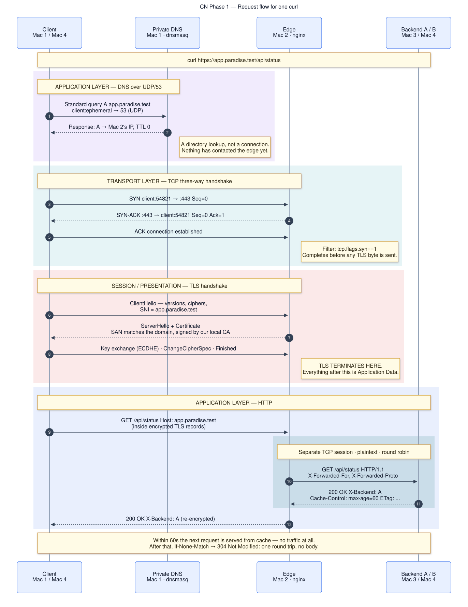

# CN Phase 1 — Private Network Service Platform

Computer Networks (CSA223) · Phase 1: Build &amp; Observe · **Team paradise**

Four macOS laptops on one LAN, running a private DNS zone, an nginx edge that
terminates TLS and load balances across two REST backends, with packet-level
evidence of every protocol layer in a single request.

> *The application stays simple — the network is the project.*

📖 **[Setup guide with copy-paste commands →](docs/index.html)**
(open `docs/index.html` in a browser, or view it on GitHub Pages)

---

## Team

| Enrolment | Name | GitHub | Primary machine | Owns |
|---|---|---|---|---|
| `2401010436` | Tajuddin Shaik | [@Taj-2005](https://github.com/Taj-2005) | Mac 1 | Private DNS (dnsmasq), repo tooling |
| `2401010090` | Anushka | [@anu-ushka](https://github.com/anu-ushka) | Mac 2 | Edge: nginx, TLS, load balancing |
| `2401010323` | Nipun | [@nipun1803](https://github.com/nipun1803) | Mac 3 | Backend A, HTTP caching |
| `2401010175` | Omkar Hadole | [@omkar-hadole](https://github.com/omkar-hadole) | Mac 4 | Backend B, verification, packet capture |

Every member can explain any part of this system, not only the part they
configured — 10 of the 50 Review-1 marks are individual.

---

## Topology

<picture>
  <source media="(prefers-color-scheme: dark)" srcset="docs/diagrams/topology-dark.svg">
  
</picture>

<sub>Source: [`topology.mmd`](docs/diagrams/src/topology.mmd) (mermaid) · regenerate with `make diagrams`</sub>

| Machine | Role | Service | Port | Cloud equivalent |
|---|---|---|---|---|
| Mac 1 | Private DNS + test client | dnsmasq | 53 UDP/TCP | Route 53 private hosted zone |
| Mac 2 | Edge: reverse proxy, LB, TLS | nginx | 443 (or 8443) | ALB + ACM certificate |
| Mac 3 | Backend A | Express | 3001 | EC2 in an ALB target group |
| Mac 4 | Backend B + test client | Express | 3002 | EC2 in an ALB target group |

Real addresses live in [`.env`](.env.example) and nowhere else; every config
file is a template rendered from it.

---

## Request flow

<picture>
  <source media="(prefers-color-scheme: dark)" srcset="docs/diagrams/request-flow-dark.svg">
  
</picture>

<sub>Source: [`request-flow.mmd`](docs/diagrams/src/request-flow.mmd) (mermaid) · regenerate with `make diagrams`</sub>

One `curl https://app.paradise.test/api/status` touches four protocols in order:

1. **DNS** · application layer, UDP/53 → Mac 1 answers with the edge's IP.
   No connection to the edge exists yet — DNS is a directory lookup.
2. **TCP** · transport layer → three-way handshake from an ephemeral port to
   `EDGE_IP:443`, completing before any TLS byte is sent.
3. **TLS** · session/presentation → ClientHello with SNI, ServerHello +
   certificate, key exchange, ChangeCipherSpec. **TLS terminates at Mac 2.**
4. **HTTP** · application layer → nginx decrypts, picks a backend by round
   robin, and makes a **separate plaintext request over its own TCP
   connection**. `X-Backend` rides back through untouched.

Full walkthrough: [docs/request-flow.md](docs/request-flow.md) ·
Layer mapping: [docs/osi-tcpip-mapping.md](docs/osi-tcpip-mapping.md)

---

## Prerequisites

macOS with [Homebrew](https://brew.sh). Admin access on Mac 1 and Mac 2.

```bash
# Mac 1
brew install dnsmasq
# Mac 2
brew install nginx mkcert nss
# Mac 3 and Mac 4
brew install node
# everywhere (usually already present)
brew install curl bind
```

`./scripts/bootstrap.sh` detects this machine's role from its IP and installs
only what that role needs.

---

## Quick start

### Step 0 · All machines

```bash
git clone <this-repo> cn-phase1-team7 && cd cn-phase1-team7
cp .env.example .env
$EDITOR .env                  # set DNS_IP, EDGE_IP, BACKEND_A_IP, BACKEND_B_IP
./scripts/render-configs.sh
scp .env user@<other-mac>:~/cn-phase1-team7/.env    # same .env on all four
./scripts/bootstrap.sh
```

Find each machine's address with `ipconfig getifaddr en0`.

### Step 1 · Mac 3 and Mac 4 — backends first

```bash
make backend-a      # Mac 3 — leave running in the foreground
make backend-b      # Mac 4 — leave running in the foreground
```

Confirm the bind address is **not** loopback:

```bash
lsof -nP -iTCP:3001 -sTCP:LISTEN     # want TCP *:3001, NOT TCP 127.0.0.1:3001
```

### Step 2 · Mac 2 — the edge

```bash
make edge           # certs + nginx config + validate + start + self-test

# distribute the CA so nobody ever needs -k
scp infra/mac2-edge/certs/rootCA.pem user@<mac1>:~/
scp infra/mac2-edge/certs/rootCA.pem user@<mac3>:~/
scp infra/mac2-edge/certs/rootCA.pem user@<mac4>:~/
```

### Step 3 · Mac 1 — DNS

```bash
make dns
./infra/mac1-dns/verify.sh
```

### Step 4 · All four machines

```bash
make client-dns     # point the resolver at Mac 1
make client-trust   # install the root CA; proves curl works without -k
```

### Step 5 · Verify, from a client (Mac 1, 3 or 4 — not Mac 2)

```bash
make preflight      # ping matrix + port reachability
make verify         # full Phase 1 acceptance test
```

Detailed per-machine runbook: **[docs/runbook.md](docs/runbook.md)**

---

## Test it on one laptop first

Before you get four machines onto a desk:

```bash
make smoke
```

Runs the entire stack — two backends, nginx, a real certificate, round robin,
the 304, and the failure demo — on a single machine with no LAN and no sudo.
Fifteen checks in about ten seconds. It uses `--cacert`, never `-k`, so a pass
means your certificate is genuinely trusted.

---

## Verification

`make verify` asserts all of the following and exits non-zero on any failure:

- All four machines ping each other, 0% loss
- `dig app.paradise.test` from a client → ANSWER is the edge, SERVER is Mac 1
- `dig @8.8.8.8` → NXDOMAIN (the name is genuinely private)
- `curl -v https://app.paradise.test/api/status` **without `-k`** → TLS
  handshake, certificate verified, HTTP 200
- Six consecutive requests show both `X-Backend: A` and `X-Backend: B`
- Requests by IP are refused (`default_server` returns 444)
- `Cache-Control`, `ETag`, `Date`, `X-Backend` all present
- A conditional request returns `304 Not Modified`, stably across both backends
- Both backends healthy, so the failure demo will work

---

## Evidence

```bash
make evidence       # writes A1 A3 A4 A5 B1 B2 B3 D1 into evidence/
./scripts/capture.sh full    # then describe C1 C2 C3 by hand
make demo-fail      # option A — writes D3
```

| Form field | File |
|---|---|
| A1 machine IPs | `evidence/A-lan-dns/A1-ips.txt` |
| A2 dnsmasq config | `infra/mac1-dns/dnsmasq.conf` |
| A3 dig from a client | `evidence/A-lan-dns/A3-dig-client.txt` |
| A4 dig @8.8.8.8 | `evidence/A-lan-dns/A4-dig-8888.txt` |
| A5 ping matrix | `evidence/A-lan-dns/A5-ping-matrix.txt` |
| B1 curl -v HTTPS | `evidence/B-https-lb/B1-curl-verbose.txt` |
| B2 load balancing | `evidence/B-https-lb/B2-lb-6x.txt` |
| B3 nginx config | `evidence/B-https-lb/B3-nginx.conf` |
| C1–C3 Wireshark | `evidence/C-wireshark/C*.md` |
| D1 caching headers | `evidence/D-cache-fail/D1-headers.txt` |
| D2 explanation | `evidence/D-cache-fail/D2-explanation.md` |
| D3 failure demo | `evidence/D-cache-fail/D3-failure-demo.txt` |

Index and rules: [evidence/README.md](evidence/README.md)

---

## Failure demonstrations

```bash
make demo-fail
```

Each captures before state, performs the break, captures after state, names the
affected layer, and restores.

| Option | Break | Observation | Layer |
|---|---|---|---|
| **A** | Stop Backend A | All responses `X-Backend: B`, no 502s | application |
| **B** | Client resolver → 8.8.8.8 | `dig` NXDOMAIN, `ping` to the IP still works | application (DNS) |
| **C** | Request port 9999 | Connection refused; host reachable | transport (TCP) |
| **D** | Stop both backends | TLS completes, nginx returns **502** | application (upstream) |

Option A is the one to record: visual, under a minute, recovers cleanly.

---

## Troubleshooting

Diagnose **top down** — the first step that fails names the layer:

```bash
ping -c3 <edge-ip>                             # 1 network
dig app.paradise.test                          # 2 DNS
nc -vz app.paradise.test 443                   # 3 transport
curl -v https://app.paradise.test/api/status   # 4 TLS
curl -i https://app.paradise.test/api/status   # 5 HTTP
```

`./scripts/status.sh` runs all five and prints a verdict.

| Symptom | Likely cause | Fix |
|---|---|---|
| `dig` times out from clients | dnsmasq on `127.0.0.1` | `listen-address=0.0.0.0`, `make dns` |
| 502 on every request | Backend bound to loopback | `lsof -nP -iTCP:3001 -sTCP:LISTEN` on Mac 3 |
| `curl: (60)` cert error | CA not trusted here | `make client-trust` — never add `-k` |
| `X-Backend` never changes | One backend down | `./scripts/status.sh` |
| 304 sometimes, 200 others | Testing `/api/status` | Use `/api/cacheable` — see below |
| nginx will not bind | Port < 1024 without root | `HTTPS_PORT=8443` in `.env`, `make render` |

Full table: **[docs/troubleshooting.md](docs/troubleshooting.md)**

---

## Two design decisions worth knowing

**The backends refuse to start on loopback.** Binding `127.0.0.1` makes a
service reachable from its own laptop and invisible to nginx — every proxied
request returns 502 while local testing looks perfect. It is the most common
failure in this project, so `services/backend/src/config.js` exits with an
explanation rather than starting.

**The 304 demo uses `/api/cacheable`, not `/api/status`.** The spec requires
`/api/status` to identify which backend answered, so A and B return different
bodies and therefore compute **different ETags for the same resource**. Behind
round robin a conditional request frequently lands on the other replica, which
does not recognise the validator and returns a full 200 — the 304 would appear
only about half the time. `/api/cacheable` returns a byte-identical body on both
machines, so revalidation is deterministic. This is a genuine distributed-caching
constraint: **validators must agree across replicas, or conditional requests
silently degrade into full responses.**

---

## Repository layout

```
├── docs/                    architecture, runbook, troubleshooting, viva prep
│   ├── index.html           ← public setup guide (start here)
│   └── diagrams/            topology + request-flow SVGs
├── infra/
│   ├── mac1-dns/            dnsmasq template + install/verify
│   ├── mac2-edge/           nginx templates, cert generation, install/verify
│   ├── mac3-backend-a/      run wrapper
│   ├── mac4-backend-b/      run wrapper
│   └── client/              set-dns, reset-dns, trust-ca
├── services/backend/        one Express codebase, two instances
├── scripts/                 bootstrap, render, preflight, verify, capture,
│                            evidence, failure demos, restore, smoke
├── evidence/                collected proof, indexed to the form fields
├── submission/              internal working docs — gitignored, see its README
├── .env.example             single source of truth for every address
└── Makefile                 `make` for the task list
```

Config files are **generated** from `*.template` + `.env`. Edit the template or
the `.env`, then `make render` — never edit a rendered `.conf`.

---

## Commands

| Command | Machine | What it does |
|---|---|---|
| `make bootstrap` | any | First-run setup; detects this machine's role |
| `make smoke` | one | Whole stack on a single laptop — 15 checks |
| `make render` | any | Regenerate configs from `.env` |
| `make dns` | Mac 1 | Install + start dnsmasq |
| `make edge` | Mac 2 | Certs, nginx config, validate, start |
| `make backend-a` / `-b` | Mac 3 / 4 | Start a backend |
| `make client-dns` | all | Point the resolver at Mac 1 |
| `make client-trust` | all | Install the root CA |
| `make preflight` | any | Ping matrix + port reachability |
| `make verify` | client | Full acceptance test |
| `make lb` | client | Six requests, assert both backends answer |
| `make evidence` | client | Write form answers into `evidence/` |
| `make capture` | any | tcpdump helper for Wireshark |
| `make demo-fail` | any | Failure demonstration menu |
| `make restore` | any | Return this machine to known-good |
| `make status` | any | What is running here, and can it see the others |

---

## Scope

**Phase 1 only** — Tasks A–G, Review 1 (50 marks: 40 team + 10 individual viva).

Phase 2 extensions (backup DNS, TTL cutover, firewall isolation, HA failover,
faculty-injected fault) are **not** built. Extension points are noted in each
machine's README so Phase 2 extends this system rather than rebuilding it.

Explanations stay inside **Weeks 1–6** of the syllabus — the mid-semester scope.
Subnetting, NAT, DHCP, IPv6, routing algorithms, ARP/Ethernet framing and Wi-Fi
PHY are Weeks 7–12 and deliberately out of scope here.

## License

[MIT](LICENSE)
